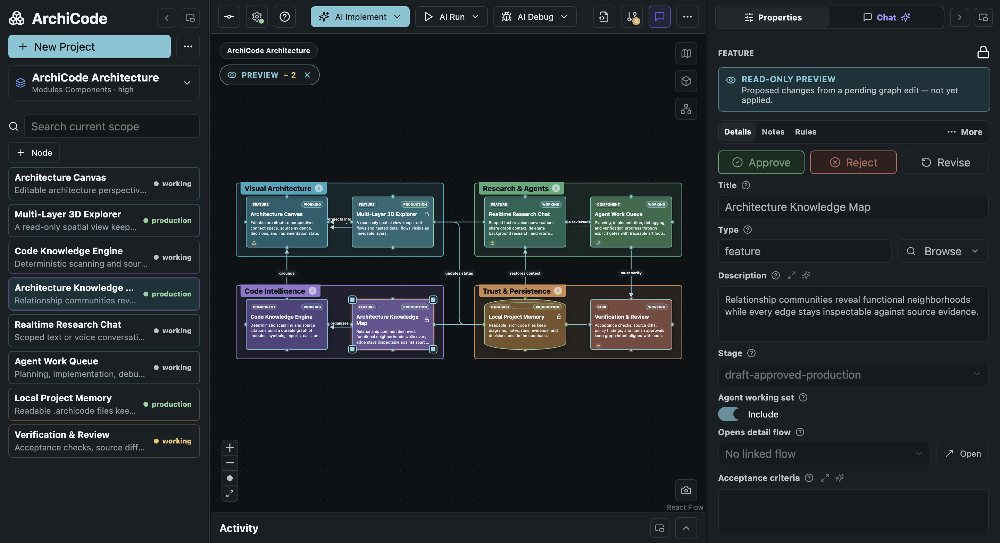
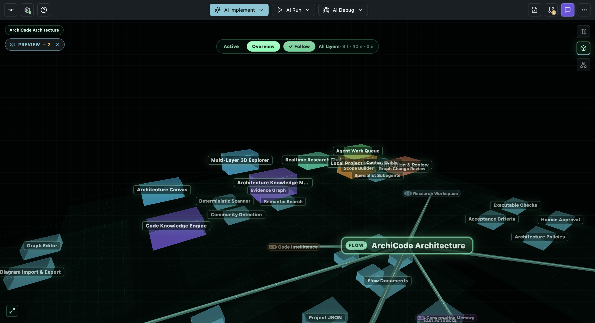
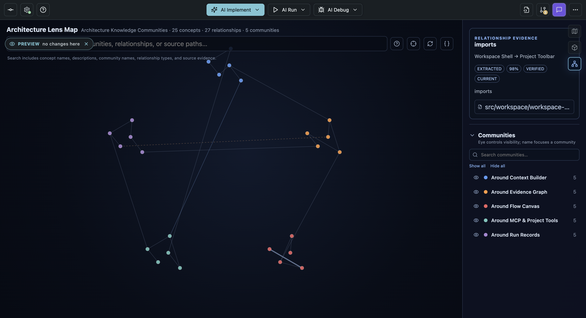
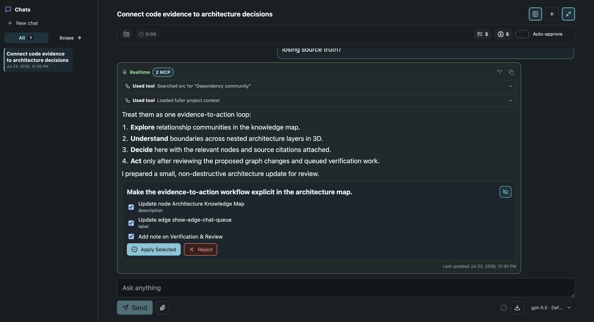

# ArchiCode

ArchiCode is a local, graph-native software engineering harness for investigating, researching, planning, building, debugging, and evolving software with AI agents.

The architecture graph is the living source of truth and the shared language between engineer and agents. Research conversations, implementation plans, source changes, tests, run history, and review decisions all stay connected to that durable model instead of disappearing into separate tools or ephemeral chat transcripts.

**Investigate → Research → Plan → Build → Debug → Verify → Resync**



## Why ArchiCode

AI can now produce code faster than an engineer can reconstruct the intent, boundaries, and consequences behind it. Traditional IDEs remain file-first, while most agent harnesses remain chat-first. Files expose the details; chat captures a moment. Neither naturally gives you the durable big picture needed to supervise a large and continuously changing AI-built system.

ArchiCode makes the graph the shared realtime working contract between humans and agents. It connects architecture, design flows, code evidence, decisions, implementation scope, and verification state in one observable workspace. You can move from a system-level view down to a source relationship, ask the Research agent to investigate or design a change, review its plan, let the build harness implement it, and follow every run, diff, test, failure, and approval back to the graph.

This is not only a diagramming, analysis, or planning layer. It is an end-to-end alternative to chat-first coding harnesses. ArchiCode can use local coding CLIs or OpenAI- and Anthropic-compatible APIs as its engines while it owns the persistent project context, orchestration, observability, and human review around them.

ArchiCode is under active development, but its core engineering loop already works: inspect an existing codebase, research and shape its architecture, queue scoped implementation, edit and test source, debug failures, verify outcomes, and reconcile the living graph as the code changes. Research is available as classical text chat or a low-latency OpenAI Realtime voice session, and longer investigations can continue as visible background tasks.

## Highlights

- **Scoped Research workspace** — reason at project, flow, subflow, or node scope using the graph, local files, images, documents, web research, durable memory, and specialist subagents.
- **Realtime voice and background research** — converse with the Research agent through OpenAI Realtime, let it inspect bounded project context with read-only tools, and delegate longer work to visible background tasks without leaving the conversation.
- **AI build harness** — turn an approved direction into scoped planning, source changes, tests, debugging, verification, artifacts, and human review rather than stopping at a suggestion.
- **Graph as living source of truth** — keep architecture intent, implementation evidence, decisions, status, and acceptance checks in the shared model used by both engineers and agents.
- **End-to-end observability** — inspect the queue, plans, tool activity, traces, logs, source diffs, failures, verification evidence, token usage, and review decisions behind agent work.
- **Evidence-backed codebase maps** — import an existing repository into architecture perspectives backed by real files, symbols, imports, calls, and source locations.
- **Editable 2D architecture canvas** — model components, features, tasks, settings, groups, dependencies, and nested detail flows.
- **Multi-layer 3D exploration** — navigate root flows and nested architecture layers without losing their spatial relationship.
- **Architecture knowledge maps** — inspect relationship-derived functional communities, trace edges to source evidence, and drill into project-wide code detail.
- **Reviewable graph proposals** — turn research into explicit node, edge, note, flow, acceptance-check, or implementation actions before anything changes.
- **Code and graph resync** — reconcile architecture after external edits using deterministic, affected-scope updates and auditable reports.
- **Acceptance and policy checks** — attach executable criteria to architecture nodes and surface deterministic architecture-policy findings.
- **Local-first project memory** — keep portable planning state under `.archicode/` while credentials and runtime-only data stay machine-local.
- **Provider and tool choice** — use Codex, Claude Code, OpenCode, Google Antigravity, Grok Build, or Kimi Code locally; connect OpenAI-compatible or Anthropic-compatible APIs; and extend agents with project skills and MCP servers.
- **Localized workspace** — follow the system language or choose English, French, Spanish, Portuguese, Simplified Chinese, or Japanese for the application UI and agent output.
- **Practical project tooling** — browse files, inspect diffs, operate Git, run local services, debug failures, open the project in a chosen code IDE, and export diagrams or project data.

## See It In Action

### Explore nested architecture in 3D

The 3D view turns root and detail flows into navigable layers. Active and overview modes make it easier to understand how a high-level capability expands into deeper implementation structure.



### Find functional communities and their evidence

The architecture lens groups related concepts into functional neighborhoods. Select a relationship to see its origin, confidence, verification state, freshness, and supporting source location.



### Research, plan, and build from the same context

Research chat stays scoped to the relevant graph context. Use focused text chat or a realtime voice conversation, let longer investigations continue in the background, retain decisions and todos, and return a concrete change set for approval. Approved implementation work then moves through the build harness—planning, source changes, tests, debugging, verification, and review—without severing the connection to the architecture that requested it.



## Website and Downloads

Visit [archicode.pixel-hat.com](https://archicode.pixel-hat.com/) for the project website, product tour, and download links.

Desktop builds are published through [GitHub Releases](https://github.com/roymasad/ArchiCode/releases):

- **macOS** — signed builds are available from GitHub Releases.
- **Windows** — unsigned builds are available from GitHub Releases. For a signed Windows build, install ArchiCode directly from the Microsoft Store.

## Run Locally

ArchiCode requires Node.js 22.12 or newer and npm.

```bash
npm install
npm run dev
```

The renderer development server runs at `http://localhost:42873/`, and Electron opens the desktop workspace.

## Verify Changes

```bash
npm run typecheck
npm run i18n:check
npm test
npm run build
```

To regenerate the four deterministic README screenshots:

```bash
npm run visual-qa:readme
```

The command writes review copies to `artifacts/visual-qa/` and publishes the stable README images under `docs/assets/`. Electron screenshot capture may need to run outside a restricted sandbox.

## Package The App

```bash
npm run pack
npm run dist:mac
npm run dist:win
npm run dist:store
```

`pack` creates an unpacked application under `release/`. macOS notarization runs when the required Apple credentials are present; local builds otherwise skip it.

## Project Data

Each project is a normal folder with a `.archicode/` directory. Portable project metadata, flows, and ledgers are readable and Git-friendly; machine-local settings, credentials, runs, caches, and generated artifacts are kept out of source control by default.

See [TECHSPEC.md](TECHSPEC.md) for the complete process architecture, storage contracts, importer and resync pipeline, knowledge-map model, agent orchestration, provider behavior, security boundaries, and test matrix.

## Author

Created and maintained by Roy Massaad.

## License

ArchiCode is open-source software released under the GNU Affero General Public License, version 3 only (`AGPL-3.0-only`). Commercial use, modification, distribution, and sale are permitted subject to the AGPL, including its source-availability and network-use requirements.

A separate commercial license is available for organizations that need different terms, including closed-source distribution.

See [LICENSE](LICENSE), [LICENSING.md](LICENSING.md), and [NOTICE](NOTICE).

## Contributing

External contributors must accept the [Individual Contributor License Agreement](CLA-INDIVIDUAL.md). If an employer or another organization owns the contribution, an authorized representative must also execute the [Corporate Contributor License Agreement](CLA-CORPORATE.md).

Read [CONTRIBUTING.md](CONTRIBUTING.md) before opening a pull request. Contributors retain ownership while granting the rights needed for ArchiCode's public AGPL and commercial editions.
