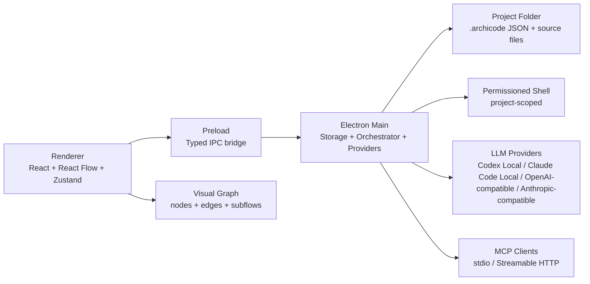
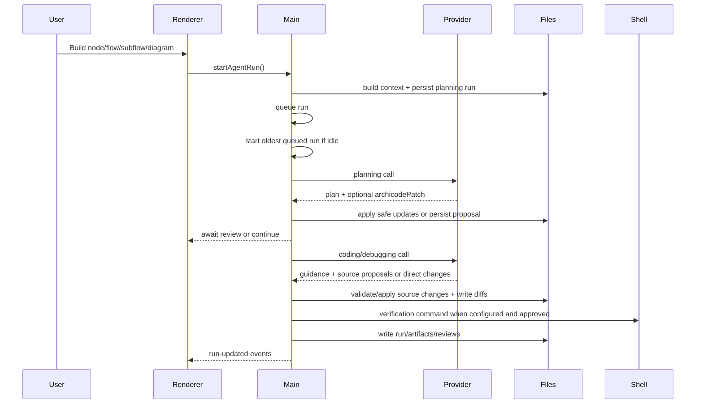

# ArchiCode Technical Specification

ArchiCode is a local, visual-first Electron harness for designing and evolving software projects with node-based diagrams and LLM-guided workflows. The app treats the graph as the durable planning document and stores project state as readable JSON under `.archicode/`.

This document describes the current implementation architecture, durable data model, runtime flows, security boundaries, and major UI surfaces.

## Goals

- Provide a visual alternative to chat-first coding sessions.
- Keep architecture, feature plans, statuses, notes, incidents, runs, artifacts, and LLM proposals readable by humans and models.
- Let users queue node, subflow, flow, or whole-diagram work while keeping write-capable code work sequential by default.
- Give LLMs enough structured context to plan, ask focused questions, propose graph changes, use approved tools, and produce implementation or debugging work.
- Keep risky operations permission-gated, project-scoped, and reviewable.
- Keep the repository suitable for public open-source development by avoiding hidden required services and documenting local state clearly.

## Tech Stack

- Desktop shell: Electron 33
- Build tooling: electron-vite, Vite, TypeScript
- Renderer: React 18
- Canvas: `@xyflow/react` / React Flow
- State: Zustand
- Validation: Zod
- UI primitives: Radix UI primitives with local ArchiCode wrappers
- Icons: Lucide React
- MCP: `@modelcontextprotocol/sdk`
- Local persisted app settings: electron-store
- Tests: Vitest
- Packaging: electron-builder

## Process Architecture

ArchiCode is split into Electron main, preload, renderer, and shared modules.



### Main Process

Main process modules:

- `src/main/index.ts`: Electron lifecycle, window creation, IPC registration, renderer event forwarding.
- `src/main/storage/`: project persistence split into focused modules — `persistence.ts` (JSON read/write), `projectStore.ts` (project load/create/migrations, shareable/local-state separation, `.gitignore`/`.gitattributes` management), `runEngine.ts` (run queue, phases, shell execution, review gates), `contextBuilder.ts` (graph-aware context construction), `patches.ts` (patch/proposal application), `notes.ts`, `ledgers.ts` (graph-change ledger and archive), `artifacts.ts`, `acceptanceChecks.ts`, `agentFiles.ts` (agent instruction files and agent memory), `commandInference.ts`, `flowImportExport.ts` (flow JSON and draw.io import/export), `projectDocumentExport.ts` (standalone HTML and PDF architecture documents), `graphEvidenceLocalState.ts`, `mcpSettings.ts`, `runLogs.ts`, and `runtimeServices.ts`.
- `src/main/providers.ts` and `src/main/providers/`: provider adapters and prompts, with `anthropic.ts`, `openai.ts` (chat/completions and Responses transports), and `localCli.ts` (Codex Local and Claude Code Local bridges) plus provider health checks and summaries.
- `src/main/research.ts` and `src/main/research/`: scoped research chats — `chatStore.ts`, `contextAssembly.ts`, `graphOps.ts` (research change-set validation/application), `inspectionTools.ts` (read-only CLI inspection allowlist), `memoryFold.ts` (durable agent memory), and `webFetch.ts`.
- `src/main/importer/`: the hybrid codebase importer and resync engine (see Codebase Import below).
- `src/main/microRuns.ts` and `src/main/microRunAgents/`: isolated micro-run harness and the Sherlock research, Picasso graph-design, Solomon merge-resolution, graph-reconciliation, and test-authoring subagents.
- `src/main/internalTools.ts`: the built-in ArchiCode Tools MCP server — bounded project/run inspection, code-knowledge and rule/violation queries, finite permissioned console commands, exact-approval Research rule mutations, and optional Brave web search behind the network guard.
- `src/main/policies/architecturePolicies.ts`: deterministic architecture-policy evaluation over repository relationships, imports, files, node metadata, and graph structure.
- `src/main/semanticIndex.ts`: local embedding index (BGE Small or MiniLM via `@huggingface/transformers`) for semantic code search and node semantic context.
- `src/main/projectTools.ts`: Git status/actions (init, clone, pull, push, branch create/switch, stash/pop, discard, commit) and project file tree, text, and diff previews.
- `src/main/mcp.ts`: MCP server import, refresh, tool listing, trust checks, and tool execution.
- `src/main/mcpHost.ts`: authenticated localhost MCP hosting, secret-safe bounded reads, resource templates, and validated graph mutations for external coding agents.
- `src/main/skills.ts`: project-local skill creation, listing, and prompt injection.
- `src/main/drawioImport.ts` / `src/main/drawioExport.ts`: draw.io page parsing and diagram generation for flow import/export.
- `src/main/documentText.ts`: text extraction from PDF and DOCX research attachments.
- `src/main/speech.ts` / `src/main/tts.ts`: downloadable local Whisper speech-to-text and Kokoro text-to-speech model management.
- `src/main/techStack.ts`: language/package-manager/framework detection.
- `src/main/projectConventions.ts`: project convention file collection and compaction for context.
- `src/main/updater.ts`: optional GitHub release update check plumbing.

The main process owns filesystem writes, shell execution, provider calls, MCP calls, context construction, project migrations, Git commands, runtime services, and security checks.

### Preload

Preload file:

- `src/preload/index.ts`

The preload bridge exposes a typed `window.archicode` API. The renderer does not directly access Node APIs.

### Renderer

Renderer files:

- `src/renderer/src/App.tsx`: top-level IDE shell layout and workbench view switching.
- `src/renderer/src/store/useArchicodeStore.ts`: Zustand store composed from slices under `src/renderer/src/store/` (`projectSlice`, `graphSlice`, `runsSlice`, `researchSlice`, `notesSlice`, `gitFilesSlice`, `capabilitiesSlice`, `uiSlice`).
- `src/renderer/src/components/*`: UI surfaces and panels, including the 2D canvas, read-only 3D view (`FlowCanvas3DView`), code knowledge maps (`CodeKnowledgeMapView`, `CodeDetailKnowledgeMapView`), onboarding wizard, resync dialog, research panel with memory panel, and settings.
- `src/renderer/src/utils/*`: presentation helpers for run progress/status, failure taxonomy display, keybindings, provider profiles, node context, previews, read-only logic-review prompts, and scoped Explain actions.
- `src/renderer/src/styles/app.css`: semantic theme tokens and app styling.

The renderer owns user interaction, visual graph editing, settings UI, run console, trace view, plan/source artifact previews, proposal review UI, research panel, Git UI, file browser, runtime controls, and inspector panels.

### Shared Modules

Shared files:

- `src/shared/schema.ts`: Zod schemas and TypeScript types for durable JSON models.
- `src/shared/graph.ts`: graph filtering, visible edges, duplicate nodes, subflow helpers, auto-layout helpers.
- `src/shared/contextBudget.ts`: model-aware context budget and compaction settings.
- `src/shared/execution.ts`: shell command risk classification and reusable policy matching.
- `src/shared/patchExtraction.ts`: extraction of `archicodePatch` payloads from provider output.
- `src/shared/researchExtraction.ts`: extraction and normalization of `archicodeResearch` payloads from research output.
- `src/shared/projectTools.ts`: Git/file browser shared types and porcelain parsing.
- `src/shared/capabilities.ts`: project skill and MCP view types.
- `src/shared/appCapabilities.ts`: versioned current-product capability manifest and secret-free current-project option snapshot supplied to Research and hosted MCP clients.
- `src/shared/redaction.ts`: shared structured-value and text redaction at external agent boundaries.
- `src/shared/sourceHandoff.ts`: schemas and repair logic for the `archicode_submit_source_file` / `archicode_finish_source_batch` source-handoff tools.
- `src/shared/runFailureTaxonomy.ts`: failure family/code classification for failed and blocked runs.
- `src/shared/codeKnowledge.ts` / `src/shared/knowledgeGraph.ts`: code-knowledge snapshot schema, queries, impact/path traversal, and knowledge-map viewport helpers.
- `src/shared/implementationScope.ts`: implementation-scope hint types and merging.
- `src/shared/networkGuard.ts`: SSRF network destination classification shared by internal tools and generated MCP servers.
- `src/shared/toolRepair.ts`: best-effort repair of malformed provider tool-call arguments.
- `src/shared/llmPricing.ts`: token usage aggregation and cost estimation.
- `src/shared/providerCapabilities.ts`: provider/model capability profiles.
- `src/shared/researchPersonality.ts`: research personality/verbosity presets.
- `src/shared/projectMaintenance.ts`: background code-data refresh status and changed-file merge helpers.
- `src/shared/runtimeInsights.ts`: runtime log URL/insight extraction.
- `src/shared/terminalText.ts`: terminal text normalization.
- `src/shared/fixtures.ts`: seed project fixture.
- `src/shared/templates.ts`: first-run project templates.

## Project Storage Model

Each ArchiCode project is a normal folder containing a `.archicode/` directory.

```text
.archicode/
  project.json
  flows/
  notes.jsonl
  graph-changes.jsonl
  graph-changes-archive.jsonl
  skills/
  local.json
  runs/
  incidents/
  artifacts/
  summaries/
  memory/
  manifests/
  reviews/
  runtime/
  tmp/
```

ArchiCode creates project ignore rules so durable planning files can be shared while local runtime records stay out of source control.

### Shareable State

- `project.json`: project identity, active flow, context/review/verification settings, graph customization, reusable guidance/decision/policy definitions, web-search behavior, skill enablement, command hints, run target profiles, environment notes, stack assumptions, and enabled agent tools. Workstation provider profiles, configured MCP servers, local paths, shell approvals, and personal UI preferences are removed or neutralized before this shared file is written.
- `flows/*.json`: flow metadata, nodes, edges, subflows, groups, positions, sizes, visual appearance, stages, flags, todos, dependencies, attachments, tech stack, acceptance criteria/checks, implementation-scope hints, evidence anchors, and rule attachments.
- `notes.jsonl`: node-scoped user notes, LLM questions, user answers, system notes, category, priority, resolved state, and attachment IDs.
- `graph-changes.jsonl` / `graph-changes-archive.jsonl`: appendable graph change ledger (with archive rollover) for agent context, smart diff history, and implementation status. ArchiCode can add `.gitattributes` `merge=union` rules for the shared JSONL ledgers so branch merges do not conflict.
- `skills/*/SKILL.md`: optional project-local model instructions that can be enabled per project.

### Ignored Local Or Derived State

- `local.json`: machine-local overlay for the absolute root path, environment/shell settings, filesystem permissions, provider profiles without API keys, personal notifications/canvas preferences, and the external MCP host token.
- `runs/*.json`: agent/build/debug/run records, permission decisions, logs, planned commands, MCP decisions, review gates, affected nodes, and instructions.
- `incidents/*.json`: manually reported bugs, bug-note incidents, failed-run incidents, and runtime-service incidents.
- `artifacts/`: logs, diffs, screenshots, attachments, generated files, patch/planning proposals, context manifests, memory artifacts, and plans.
- `summaries/`: compacted context summaries and durable summaries.
- `memory/`: project, flow, subflow, and node memory records.
- `manifests/`: per-run context manifests.
- `reviews/`: accepted/rejected patch, planning, code, and research proposal decisions.
- `runtime/`: local runtime service state plus importer/resync/analysis records — `initial-import-report.json`, `resync-baseline.json`, resync reports, `import-review-latest.json`, the code-knowledge snapshot, architecture-policy evaluation, source-analysis baseline, project-maintenance status, and graph-evidence freshness observations.
- `tmp/`: temporary files used by providers and runtime workflows.

App-wide workstation state lives outside the project in Electron's user-data directory. It includes global provider and MCP profiles, encrypted provider/MCP/Brave secrets, Research chat stores and backups, keybindings, speech/TTS settings and models, recent projects, and other personal preferences. Secrets are encrypted with Electron `safeStorage` when platform encryption is available and are never written to shareable project JSON.

## Durable Domain Model

### Nodes

Node stages:

- `planned`
- `plan-approved`
- `working`
- `draft`
- `draft-rejected`
- `draft-approved-production`

Node flags:

- `changed`
- `has-diff`
- `needs-attention`
- `has-attachments`
- `llm-question`
- `modified-not-built`
- `user-approved`

Nodes also support visual metadata:

- background color
- shape: `rounded`, `rectangle`, `capsule`, `document`, `database`, `note`, `ellipse`, `diamond`, `hexagon`, `parallelogram`, `cloud`, or `actor`

Nodes may also carry a bounded `implementationScope` containing `own`, `share`, and `cover` hints for repository files, directories, classes, functions, and other exported symbols. These mappings are deterministic for the same analyzed snapshot and analyzer version, but remain best-effort navigation hints: they can be incomplete, inaccurate, or stale, and never act as permissions, edit boundaries, or replacements for node intent and acceptance criteria. New evaluations include a `checkedAt` timestamp so users and agents can judge hint age; legacy metadata without it remains readable. Missing hints mean unknown rather than no implementation.

Approved production nodes are treated as locked when they are explicitly locked, have stage `draft-approved-production`, or include the `user-approved` flag. LLM patches cannot approve, lock, or silently mutate approved nodes.

### Notes

Note kinds:

- `user-note`
- `llm-question`
- `user-answer`
- `system-note`

Notes also store:

- author
- category: `note`, `decision`, `bug`, or `task`
- priority: `low`, `normal`, `high`, or `urgent`
- attachment IDs
- optional reply-to note ID
- resolved state
- pinned state

Resolved notes are filtered out of model context. Users can resolve, reopen, pin, delete, or purge resolved notes by node or project. Project settings can purge resolved notes automatically when a node is approved.

### Guidance, Decisions, And Architecture Policies

Reusable rules live in `project.settings.nodeRules`; nodes attach them by ID. A rule can be:

- `guidance`: durable prose instructions supplied to agents
- `decision`: durable context with optional alternatives and consequences
- `policy`: a deterministic local check with `info`, `warning`, or `error` severity and `advisory` or `enforced` enforcement

Rule status is `active`, `disabled`, or `superseded`. Live policy constraints cover forbidden/required/allowed dependencies, dependency cycles, forbidden imports, file naming/location conventions, required companion files, required node metadata, required/forbidden graph relationships, and orphan nodes. File policies are project-wide; graph policies can target attached nodes or expand to subflow, flow, or project scope.

Policy evaluation writes `.archicode/runtime/architecture-policy-evaluation.json`. Findings retain stable IDs, source/target evidence, graph assignments when available, and first-seen/checked timestamps. Canvas and node signals show current violations. An active `error` + `enforced` policy fails a source-changing run only when that run introduces a violation after its captured baseline; pre-existing violations establish context but do not fail the run by themselves.

### Runs

Run phases:

- `planning`
- `awaiting-plan-review`
- `coding`
- `awaiting-code-review`
- `debugging`
- `needs-replan`
- `verifying`
- `complete`

Run statuses:

- `preparing`
- `queued`
- `needs-permission`
- `running`
- `planning`
- `awaiting-plan-review`
- `coding`
- `awaiting-code-review`
- `debugging`
- `needs-replan`
- `verifying`
- `succeeded`
- `failed`
- `cancelled`

Run records include provider, scope, prompt summary, command, cwd, env, risk, filesystem scope, shell permission decision, web-search decision, MCP decision, MCP tool calls, context artifacts, plan artifacts, source diff artifacts, affected nodes, planned commands, planned allowed roots, review decisions, policy-baseline violation IDs, todos, logs, run instructions, error dismissal state, queue removal state, and timestamps.

### Runtime Services

Runtime services track long-running commands started from run target profiles:

- project root
- profile ID
- label and kind
- command and cwd
- process ID
- status: `starting`, `running`, `stopped`, `failed`, or `stale`
- detected URL and ports
- stdout/stderr/system logs
- timestamps and exit code

Runtime output is scanned for URLs so users can open local app targets from the UI.

### Debug Incidents

Debug incidents can come from:

- manual bug reports
- bug notes
- failed runs
- failed or stale runtime services

AI Debug collects open incidents, builds focused context, and starts a debugging phase run scoped to repair regressions rather than perform feature work.

## Renderer Architecture

### IDE Shell

`App.tsx` composes the main layout:

- left `ProjectSidebar`
- top `ProjectToolbar`
- center `FlowCanvas`
- right `NodeInspector` or `ResearchPanel`
- bottom/collapsible `SettingsAndRuns`
- global `PermissionModal`
- global `BuildQuestionCheck`
- global `CodebaseOnboardingWizard`
- global `ErrorBoundary`

### Project Sidebar

`ProjectSidebar.tsx` provides:

- project open/create controls
- template selection
- flow navigation
- nested subflow navigation
- Needs Reply section for unresolved LLM questions
- graph search
- compact node list
- Add Node menu

### Flow Canvas

`FlowCanvas.tsx` renders React Flow:

- custom node cards
- visible nodes filtered by active subflow/search
- visible edges filtered to visible endpoints
- drag-to-connect edge creation
- node drag persistence
- edge selection
- keyboard shortcuts for duplicate/copy/paste/delete
- minimap and controls
- configurable canvas backgrounds and edge style

### Node Cards

`ArchicodeNodeCard.tsx` renders graph nodes with:

- node type
- stage pill
- lock state
- changed/diff status
- question/note/attachment count badges
- deterministic architecture-policy violation badges with a scoped Explain action
- visual shape and color metadata
- React Flow handles

### Inspector

`NodeInspector.tsx` provides tabs for:

- Details
- Notes
- Rules
- expandable Advanced state

Users can edit node metadata, answer LLM questions, resolve notes, attach references, approve/reject/revise nodes, run node-scoped agent work, and manage selected edge labels. The Rules tab creates, edits, attaches, disables, supersedes, and removes reusable guidance, decisions, and deterministic policies; current node violations are surfaced separately from planning-readiness signals.

The Advanced tab shows implementation-scope hints as a read-only, collapsed-by-default summary with provenance and a “Checked as of” timestamp. Expansion persists while selecting different nodes, then resets after leaving the Advanced tab. Direct manual editing is intentionally not the primary workflow.

Applied AI Implement source-file proposals persist their explicit `path` → `nodeId` associations as implementation-scope hints. Node-scoped direct-write runs use their source diff as a bounded fallback. Project-scoped runs also mark the project node as covering the repository root. On project load, ArchiCode conservatively repairs older projects only for nodes with no scope object, only from successful applied runs, and only when the artifact's proposed content still exactly matches the current file. Existing importer/agent/chat/user scopes are never replaced by historical replay.

### Top Toolbar

`ProjectToolbar.tsx` provides:

- active project/provider status
- Git panel entry
- help entry
- research panel toggle
- planning proposal review entry
- theme toggle
- activity panel toggle
- settings dialog
- Build action
- Run App action
- AI Implement action
- AI Debug action
- bug report dialog
- runtime service controls
- graph and JSON tools
- multi-flow PDF and standalone HTML architecture export
- read-only Research logic review for the current flow or all project flows

Settings tabs cover:

- General (project details)
- Shortcuts (customizable keybindings)
- LLM Providers
- Build Targets (commands and run target profiles)
- Agent Instructions (agent memory and instruction files)
- Security (filesystem policy, shell policies, web search)
- Context
- LLM Profiles (phase model policies)
- MCP Skills (project skills and MCP servers)
- Advanced (appearance and advanced UI options)

### Research Panel

`ResearchPanel.tsx` provides scoped chat for:

- project
- flow
- subflow
- node

Research chats support:

- local persisted history
- current-scope, parent-scope, and recent-other history grouping
- archive
- fork from an earlier message, in-flight cancellation, and failed-turn retry
- Markdown/JSON download and clipboard export
- provider selection through project settings
- web-enabled status
- image and text-document attachments for providers that support them
- optional local speech input, text-to-speech, personality, and verbosity preferences
- live parent-tool and isolated-subagent activity
- per-turn/session context, token-usage, and estimated-cost indicators when providers report usage
- copyable visible answers
- MCP tool-call badges
- approval-gated graph change sets
- a memory panel (`ResearchMemoryPanel.tsx`) exposing durable agent memory records

### Activity Panel

`SettingsAndRuns.tsx` contains:

- Queue
- Trace
- Errors
- Console
- optional Plan artifacts
- optional Source Changes artifacts
- optional Git activity
- optional Questions

`RunConsole.tsx` presents sequential queued work, selected run details, permission prompts, review prompts, logs, cancel, reject, retry, dismiss, and remove-from-queue actions.

`RunTrace.tsx` summarizes run progress and exposes raw provider/runtime logs.

`ProjectConsole.tsx` provides a local project shell session with streamed output.

The Activity header also reports background semantic-index/code-knowledge maintenance, retryable refresh failures, and source files changed since the last graph analysis.

### Artifact Previews

The Activity Plan and Source Changes views use the shared `ArtifactPreview` renderer from `ArtifactBrowser.tsx` for read-only plan text and file-grouped diff previews with summaries, line numbers, and added/removed/hunk styling. Run cards can start a scoped Research chat through their Explain action. The standalone searchable/type-filtered `ArtifactBrowser` component, including its artifact Explain action, exists but is not currently mounted as a user-facing Activity tab.

### Project File Browser

`ProjectFileBrowser.tsx` provides:

- project file tree
- Git status badges
- text preview with language hinting
- binary/truncated file handling
- staged and working-tree diff preview

Project file preview is read-only.

File cards can start a scoped Research explanation of the file's purpose, symbols, relationships, Git changes, and risks.

### Git UI

`GitPanel.tsx` and `GitActivityLog.tsx` provide:

- current branch, upstream, ahead, and behind summary
- changed file list with additions/deletions
- recent commits
- pull and push
- create a branch and switch among existing branches
- stash, pop, and discard changes
- commit selected files with a message, with AI-assisted commit-message drafting
- recent Git operation output

When no repository exists, the Git panel can initialize a local Git repository without adding a remote or creating an initial commit. Projects can also be opened by cloning a repository from the start page.

### Proposal Review

`PatchReviewPanel.tsx` reviews graph-content and structural operations belonging to runs that are awaiting plan review:

- one decision per operation
- accept/reject selected operations
- review result display
- schema validation errors

The panel is mounted only while manual planning review is enabled and at least one run is actively awaiting plan review. Source-file deletion/review decisions are handled in the run console rather than this graph review panel.

### Help

`HelpPage.tsx` documents the intended workflow inside the app:

- start with a real folder
- map work as a graph
- let agents work from graph context
- answer questions on nodes
- build, run, and debug
- review risky changes

## Main Process Architecture

### IPC

`src/main/index.ts` registers IPC handlers (all namespaced `archicode:*`) for:

- default root, recent projects, app update checks, window controls, and system notifications
- global provider setup, global research personality/verbosity, and secret status
- project create/open/load/reveal/delete-state, open in VS Code, and open file with system app
- flow save/import/export, draw.io import/export, project bundle export, and selected-flow PDF/HTML document export
- project repair
- node updates and AI node-field enhancement
- notes, note resolution/pinning, delete, purge (resolved and system)
- attachments, reference files, and image picking
- project details/settings plus project-maintenance status, retry, dismissal, and source-drift reporting
- provider health checks
- project skills
- MCP server import/update/refresh/list plus MCP registry search/install
- patch/proposal list and apply
- artifact text and data-URL preview
- Git status, init, clone, pull, push, branch create/switch, stash/pop, discard, commit, commit-message drafting, and `.gitattributes` management
- project file tree, file text preview, and file diff preview
- agent run start/approve/reject/cancel/retry/dismiss/remove and subagent responses
- acceptance-test authoring, execution, and clearing
- build/run profile execution
- runtime service list/start/stop/restart
- bug report create/update and incident/runtime debug runs
- project console start/write/stop
- research chat list/create/rename/archive/fork/cancel/send/summarize, per-chat auto-approval, and agent memory reads
- research graph change-set apply
- codebase import (map/cancel/report) and resync (run/cancel/reports)
- code-knowledge snapshot reads and graph evidence refresh
- semantic index status/rebuild/clear, model preference, and semantic context lookups
- speech and TTS model download/delete/status and settings
- keybindings load/save
- external MCP host status and token regeneration

### Storage And Migrations

`src/main/storage/`:

- ensures `.archicode/` folder structure
- writes `.archicode/.gitignore` and can add union-merge `.gitattributes` rules for shared JSONL ledgers
- separates shareable `project.json` from `local.json` and app-level provider/MCP/secrets/preferences
- loads and validates JSON through Zod
- migrates older settings/provider labels
- recovers orphaned in-progress runs
- infers build/run commands from common project files
- reads/writes flows, notes, incidents, runs, artifacts, summaries, memory, manifests, reviews, skills, and local settings
- refreshes deterministic architecture-policy evaluations when graph or source evidence changes
- maintains the graph-change ledger lifecycle: records are `pending` until a verified run covering them marks them `implemented`, records whose targets disappear are reconciled to `obsolete` at project load, and older records roll into the archive ledger

Command inference detects:

- `package.json`
- package manager lockfiles
- Flutter `pubspec.yaml`
- Rust `Cargo.toml`
- Go `go.mod`
- Maven `pom.xml`
- Gradle files

Inferred commands are hints, not preapproved shell permissions.

After a local direct-write implementation batch, ArchiCode can create missing project handoff files (`.gitignore`, `AGENTS.md`, and `README.md`) using the detected project commands and recorded technology. Existing user-owned files are preserved; only the exact untouched legacy generated `AGENTS.md` template is automatically migrated.

### Project And Diagram Export

Flow JSON and draw.io XML can be imported/exported from the active graph scope. Full loaded project metadata can be exported as one JSON bundle. For human-readable handoff, users can select one or more flows and export a standalone HTML document or an A4-landscape PDF containing each flow diagram, flow metadata, and a node index. PDF generation uses an isolated hidden Electron window with JavaScript disabled.

### Codebase Import

When a folder has no ArchiCode graph metadata, the onboarding wizard runs the hybrid importer (`src/main/importer/`, importer version `architecture-atlas-v3`). Deterministic analysis produces the evidence; a provider annotates and reviews it. Edges are derived from real source relationships and keep citations — the model cannot claim structure the analysis did not observe.

Pipeline stages:

- **Scan** (`scanner.ts`, `ignore.ts`, `sourceCache.ts`): bounded repository scan honoring ignore rules, with one immutable per-import source snapshot shared by parsing, inventory, and semantic preparation.
- **Parse** (`parsers.ts`, `treeSitter.ts`, `resolvers/`): tree-sitter WASM parsing with per-language dependency resolvers for JS/TS, Python, Go, Rust, C-like, C#, and PHP, plus a generic fallback for unsupported languages. Parsers and resolvers may run concurrently; results are restored to deterministic repository order.
- **File graph** (`fileGraph.ts`): a language-independent file dependency graph with resolved internal relations.
- **Inventory** (`inventory.ts`, `projectMetadata.ts`): package scripts, dependencies, workspaces, modules, entrypoints, routes, catalogs, data files, docs, platform targets, and build outputs. Imported evidence-backed project metadata replaces the onboarding fixture metadata.
- **Aggregate and organize** (`aggregate.ts`, `organize.ts`, `symbolRanking.ts`): module-graph clustering into functional areas with hierarchical drill-down subflows instead of one flat canvas.
- **Runtime edges** (`runtimeEdges.ts`): high-confidence IPC/HTTP/hosting/runtime-load edges that import analysis alone cannot see.
- **Atlas and lens flows** (`atlas.ts`, `lensFlows.ts`, `emit.ts`): emission of the canonical code-structure flow plus perspective lens flows (system context, product capability, UX/journey, runtime/integration, data, infrastructure, dependency health) when supporting evidence exists. Every lens concept stays joined to one canonical `code:*` subject through immutable evidence anchors; unsupported perspectives are omitted rather than fabricated.
- **LLM annotation** (`mapper.ts`, `insights.ts`, `coherence.ts`): provider calls for architecture generation and repair, bounded deep-hierarchy annotation with controlled concurrency, lens repairs, and final derived-edge labeling. Bounded README/manifest/build/deployment excerpts ground product purpose so it is not guessed from imports alone.
- **Semantic truth** (`semanticTruth.ts`): enforcement that generated operations preserve subject identity, evidence paths, and citation validity.
- **Quality** (`quality.ts`): import quality evaluation and comparison between architecture candidates.
- **Agentic review** (`reviewer.ts`): post-generation review over bounded source slices and flow partitions. Review effort (light/balanced/deep/ultra) caps work at 5/10/15/30 partitions. Only structured review edits are allowed; subject identity, implementation scope, and extracted edge evidence remain immutable, lens-only inferred relationships are marked inferred and capped at `0.7` confidence, and every edit batch is validated transactionally with deterministic retry feedback. The evolving review ledger is written to `.archicode/runtime/import-review-latest.json`.
- **Layout and persistence** (`layout.ts`, `validate.ts`): validated graph operations are materialized in memory before any flow is written, then persisted in batches so a bad reference cannot leave a partially applied graph.
- **Knowledge snapshot and reports** (`knowledgeSnapshot.ts`, `importReports.ts`, `importSummary.ts`): a file/symbol-level code-knowledge snapshot under `.archicode/runtime/` for the knowledge map views and code-knowledge query tools, plus the retained initial import report.

Imported nodes are marked `draft-approved-production` because the importer documents an already-implemented codebase. Imports support cancellation, optional deadlines, live phase progress with elapsed time, and record per-phase timings and provider-call outcomes.

### Resync

Resync (`src/main/importer/resync.ts`) is deliberately separate from initial import: the persisted user-visible flows are the source of truth. Resync detects a repository delta, builds an impact cone, constructs an in-memory deterministic evidence candidate, and reconciles only affected entities into the existing flows.

- `.archicode/runtime/resync-baseline.json` stores compact synchronization metadata only: content/parser/symbol/relationship fingerprints, normalized parser output for unchanged-file reuse, per-entity evidence paths and graph fingerprints, and importer/resync/user/modified/legacy ownership classification.
- The resync dialog defaults to **Project (all flows)**; users can instead select specific flows. Per-flow checkpoints preserve the last reconciled repository state for omitted flows so a scoped run cannot consume changes another flow still needs.
- Resync reports (`resyncReports.ts`) record delta, applied changes, and review-required items; results surface as up-to-date, synchronized, or review-required.
- Legacy projects without a baseline seed one from current state without graph mutations.

### Semantic Index

`src/main/semanticIndex.ts` maintains a local embedding index (384-dimension vectors) with two selectable on-device models: BGE Small en v1.5 (higher quality, 512-token window) and MiniLM-L6-v2 (faster, 128-token window). Model files ship as packaged resources (`npm run semantic-model` fetches them for dev). The index powers code↔doc semantic links during import, node semantic context, and semantic code search, and can be rebuilt or cleared from settings. No source is sent to a provider for indexing.

### Code Knowledge Maps

Two renderer views visualize import evidence directly:

- `CodeKnowledgeMapView.tsx`: an eagle-view module map over architecture nodes grouped into functional communities.
- `CodeDetailKnowledgeMapView.tsx`: a file/symbol graph from the code-knowledge snapshot with `contains`, `dependency`, `calls`, and `runtime` edges, impact and shortest-path exploration, and rendering caps (1800 nodes / 6000 edges).

### Background Code-Data Maintenance

The main process watches relevant source/config paths and schedules a bounded background refresh after external edits, completed AI source runs, initial load, or a user retry. It rebuilds the semantic index when enabled and refreshes the code-knowledge/evidence snapshot from one prepared scan/parse pass. Maintenance waits while an agent run owns the project, coalesces subsequent changes, publishes live status over IPC, and persists source hashes plus changed-file facts under `.archicode/runtime/`.

This maintenance updates derived code data; it does not silently rewrite the user-visible graph. External source edits therefore also set a “graph analysis may be outdated” warning with the concrete added/modified/deleted files until the user resyncs or dismisses the warning.

## Agent Work Queue

ArchiCode uses a sequential work queue by default.



Only one queued job runs per project at a time. This reduces conflicting edits and makes graph evolution easier to understand.

Run phases include planning, plan review, coding, code review, debugging, replan, verification, and completion. Runs can pause for shell permission, MCP approval, plan review, code review, or a replan decision.

## Provider Architecture

Provider adapters live in `src/main/providers.ts` with per-provider implementations under `src/main/providers/` (`anthropic.ts`, `openai.ts`, `localCli.ts`).

User-selectable provider kinds:

- `codex-local`
- `claude-local`
- `openai-compatible`
- `anthropic-compatible`

The durable schema still accepts `offline-manual` so older projects can load, but current provider-profile creation and compatibility selectors do not offer it and new projects do not seed it.

### Codex Local CLI

Uses the local `codex` command:

- checks `codex --version`
- checks `codex login status`
- runs `codex exec`
- passes selected sandbox mode
- passes Codex global web-search and approval flags before `exec`
- writes final message to a temporary output file

Codex Local can make direct source edits when the sandbox permits it.

### Claude Code Local

Uses the local `claude` command through the same local CLI bridge (`src/main/providers/localCli.ts`). Like Codex Local, it can make direct source edits when configured with write-capable command access; ArchiCode maps the common access setting to Claude permission modes rather than claiming a true filesystem sandbox. It also participates in the host-controlled delegation envelope so nested subagent work still runs through ArchiCode's micro-run registry.

The local CLI command can be overridden per provider (`localCommand`), and both local providers share process tracking, cancellation, and research tool-loop support.

### OpenAI-Compatible

Uses a chat/completions-compatible HTTP API (a Responses-API transport is also supported for provider profiles). Settings include:

- model
- base URL
- API key resolved from app-local secret storage (encrypted with Electron `safeStorage` when available) or a legacy environment-variable reference
- optional detected/overridden context window
- phase model policies

Health checks query `/models` and try to infer context window metadata.

OpenAI-compatible providers cannot directly edit local files. During coding/debugging phases they return `propose-source-file` operations, which ArchiCode validates, auto-applies when safe, or holds for review.

### Anthropic-Compatible

Uses the Anthropic Messages API shape. Settings include:

- model
- base URL
- API key resolved from app-local secret storage (encrypted with Electron `safeStorage` when available) or a legacy environment-variable reference
- optional context window override
- phase model policies

Anthropic-compatible providers follow the same reviewed source-file operation path as OpenAI-compatible providers.

### Phase Model Policy

Each provider stores phase-specific generation policy:

- `temperature`
- `reasoningMode`: `off`, `low`, `medium`, or `high`
- `maxOutputTokens`
- optional `modelOverride`
- optional enabled tools

Default behavior is tuned by phase:

- planning: low temperature, high reasoning
- coding: low temperature, medium reasoning
- debugging: very low temperature, high reasoning
- review: low temperature, medium reasoning
- verifying and summarizing: low temperature, low reasoning
- brainstorming: medium temperature, medium reasoning

Provider adapters infer a capability profile from provider kind and model name. Unsupported controls degrade to prompt/runtime metadata instead of fake request fields.

## Tooling Capabilities

### Web Search

Project settings control whether web search is enabled, whether per-run approval is required, and whether search artifacts are persisted. Research chat can also fetch directly referenced URLs when web search is enabled.

The built-in ArchiCode Tools server (`src/main/internalTools.ts`) provides a Brave-backed web search tool when Brave is selected and its key is saved, alongside bounded project inspection tools. All model-directed fetches pass the shared network destination guard (`src/shared/networkGuard.ts`), which classifies the resolved destination on every redirect hop: loopback is allowed for local dev troubleshooting, link-local/cloud-metadata addresses are always blocked, and private-network addresses are blocked.

### Project Skills

Project skills are Markdown files under `.archicode/skills/<skill-id>/SKILL.md`.

Skill IDs must be lowercase, hyphenated, and 3-64 characters. Enabled skills are read and inserted into prompts as project-local instructions. Skills are useful for repo-specific conventions, domain rules, or repeatable review/build expectations.

### Rules And Policy Tools

All run agents receive the built-in `archicode_project_manage_rules` tool as a read-only surface for listing reusable guidance/decisions/policies and filtering current violations by flow, node, rule, severity, or enforcement. Research receives the same reads plus `create` and `update`; each mutation pauses for a non-reusable approval of that exact payload before changing the rule library or node attachments. Policy linting itself is deterministic and local, not an LLM call.

### MCP Servers

MCP settings store:

- servers

ArchiCode does not impose a global tool-call count or truncate tool results in
the provider execution path. Tool loops continue until the provider returns a
final response, the user cancels, approval is denied, or an actual provider/tool
error occurs. A narrow loop detector stops the third consecutive call with the
same tool name and canonicalized arguments; any different call resets that
streak.

Each server stores:

- id and label
- transport: `stdio` or `streamable-http`
- command, args, cwd, env, or URL
- enabled and trusted state
- source: project, imported Codex config, imported JSON, or registry
- optional HTTP headers and default tool-approval mode
- refreshed tools, resources, and prompts
- last refresh status

Enabled untrusted MCP servers require explicit approval for model runs. MCP tool calls are logged with tool name, arguments, status, result summary, errors, and timestamps.

ArchiCode can also host its opened project as an authenticated Streamable HTTP MCP server bound to `127.0.0.1`. That server exposes:

- a versioned ArchiCode capability/current-options orientation payload
- bounded project, run, incident, runtime-service, artifact, and graph-change reads
- targeted flow, node, subflow, rule, and smart scoped-context resources, including discoverable URI templates
- cross-model graph search over flows, subflows, groups, nodes, edges, rules, notes, runs, incidents, artifacts, and graph changes
- validated project/flow/node/edge/subflow/group/note mutations, acceptance-check execution, and run-target profile upserts

Hosted responses pass through structured secret sanitization; artifact text is redacted and character-bounded. Mutation responses return compact receipts instead of the full project bundle. Agent/run queue and debug actions, provider credentials, MCP credentials, and security settings intentionally remain in-app user-reviewed controls rather than hosted mutations.

## Orchestrator Prompt Contract

Provider prompts instruct the model to:

- use a mandatory plan gate
- inspect graph state, node stages, flags, notes, diffs, artifacts, dependencies, approvals, incidents, run target profiles, reusable rules, and current policy violations
- respect `.gitignore`, supported agent instruction files such as `AGENTS.md`, `CLAUDE.md`, `GEMINI.md`, `.github/copilot-instructions.md`, `README.md`, and package scripts
- use selected project skills when relevant
- ask focused node-scoped questions if information is missing
- not modify approved locked nodes
- create or update tests for changed behavior using the existing project test framework and file patterns
- map node acceptance criteria to test coverage where practical
- record why tests could not be added or run, and mark affected nodes as needing attention
- return concise guidance
- include `archicodePatch` JSON when proposing machine-readable changes

Supported `archicodePatch` operations:

- `update-node`
- `add-note`
- `resolve-note`
- `delete-note`
- `add-artifact-reference`
- `propose-node`
- `propose-edge`
- `propose-subflow`
- `propose-graph-operation`
- `propose-project-file`
- `propose-run-profile`
- `propose-source-file`

## Patch And Planning Proposal Flow

Provider output is scanned by `extractArchicodePatch()`.

Extraction supports:

- fenced JSON
- wrapped `{ "archicodePatch": ... }`
- direct proposal objects
- varied model output containing balanced JSON objects

### Automatic Bookkeeping

By default, safe managerial operations can auto-apply:

- note creation and resolution
- flags
- transitions to `draft`
- todos
- attachments
- artifact references
- allowlisted project convention files
- run-target profile creates/replacements when build targets are not locked

Deleting notes, unlocking or approving nodes, and arbitrary node-content changes are not automatic for LLM patches.

### Reviewable Proposals

Graph-content and structural proposals never auto-apply:

- `propose-node`
- `propose-edge`
- `propose-subflow`
- `propose-graph-operation`

When manual planning review is enabled, these operations remain pending for per-operation decisions. In automatic mode they are rejected/skipped rather than silently changing graph truth. Accepted operations apply through schema validation and produce review records. Allowlisted project-file and unlocked run-profile proposals follow the automatic managerial path above; invalid or disallowed operations are rejected and recorded.

`propose-project-file` is limited to:

- `.gitignore`
- `AGENTS.md`
- `agents.md`
- `CLAUDE.md`
- `claude.md`
- `GEMINI.md`
- `gemini.md`
- `.github/copilot-instructions.md`
- `README.md`
- `readme.md`

### Source-File Proposals

API providers generate project code through a structured source handoff (`src/shared/sourceHandoff.ts`). During coding/debugging phases the model calls the `archicode_submit_source_file` tool once per file — multiple independent file calls may share one provider turn — and finishes the batch with `archicode_finish_source_batch`, reporting an explicit `complete`, `continue`, or `blocked` implementation status. Fenced `propose-source-file` JSON remains supported as an extraction fallback, and malformed tool arguments go through jsonrepair-backed repair before rejection.

Each source-file operation carries:

- `path`
- `action`: `create`, `replace`, or `delete`
- `content` for creates/replacements
- `baseSha256` for replacements
- required in-scope source attribution through `nodeId` or `nodeIds`, plus optional `reason` and `testIntent`

Safe text creates/replacements can auto-apply. Proposals fail or require review for path traversal, `.git`, `.archicode`, generated folders, lockfiles, env/secrets, stale hashes, deletes, binaries, oversized files, and sensitive config files.

Applied source changes produce source diff artifacts and mark affected nodes with diff/build flags.

## Research Chat Flow

Research chat is implemented in `src/main/research.ts` and extracted by `src/shared/researchExtraction.ts`.

Sessions are scoped to:

- project
- flow
- subflow
- node

Messages store:

- role
- visible content
- attachment IDs
- web-used state
- MCP tool calls
- optional MCP approval/continuation state
- optional canvas selection/viewport action
- isolated-subagent run summaries
- optional usage/cost metadata
- optional graph change set
- error state

The research response contract is `archicodeResearch`:

- `answer`
- optional hidden rolling `summary`
- optional `canvasAction`
- optional `changeSet`

Supported research graph operations:

- `update-project`
- `update-flow`
- `create-flow`
- `update-node`
- `update-edge`
- `add-note`
- `resolve-note`
- `delete-note`
- `create-node`
- `create-edge`
- `create-subflow`
- `create-group`
- `update-group`
- `update-subflow`
- `link-node-subflow`
- `propose-run-profile`
- `start-agent-run`
- `start-run-profile`
- `retry-run`
- `start-debugging-run`
- `author-acceptance-tests`
- `run-acceptance-checks`
- `start-runtime-debug-run`
- `start-incident-debug-run`
- `delete-node`
- `delete-edge`
- `delete-subflow`
- `delete-group`

The selected Research scope focuses prompt context but does not hard-limit what coherent graph or queue change set Archi may prepare. Operations are validated against existing and earlier-in-card graph references, ignored/approved-lock rules, placement contracts, and destructive-operation policy. Destructive operations are flagged in the UI and still require explicit approval.

Reusable rule creation/update is intentionally not a Research graph operation. It must use the exact-approval `archicode_project_manage_rules` tool so policy implications and node attachment changes are reviewed as one concrete payload.

### Isolated subagents

Research Chat and AI build runs can delegate substantial bounded work to fresh-context micro-runs:

- **Sherlock — Research Detective** performs read-only codebase, online, and topic investigation. It returns a compact evidence dossier while its full result is retained outside the parent context.
- **Picasso — Graph Architect** designs, refines, and reconciles detailed graph updates. It is proposal-only; every graph change is routed through the normal review-card pipeline and cannot auto-apply from the subagent.
- **Solomon — Merge Arbiter** is the user-facing identity of the existing `merge-resolution` micro-run. It remains approval-gated because it may edit conflicted files, run verification, and finish the merge commit.

Internal compatibility identifiers remain `merge-resolution` and `graph-reconciliation`. Subagents inherit the caller's provider and project permissions, start without the parent transcript, cannot recursively delegate, and expose only their role-specific bounded tools. Local Codex and Claude build providers use a host-controlled delegation envelope so the nested work still runs through ArchiCode's micro-run registry and activity/artifact tracking.

## Context Builder

`buildContext()` constructs focused JSON context for each run.

Inputs:

- project root
- flow ID
- optional node ID
- optional provider ID

Selection uses:

- selected node
- active subflow or flow
- graph neighbors
- dependencies
- changed/diff/modified/attention flags
- unresolved LLM questions
- active notes only
- failed recent runs
- related notes
- linked artifacts
- reusable guidance, decisions, live policies, and current deterministic violations
- summaries
- project memory records
- selected skills
- approved MCP tool metadata

Outputs:

- JSON context text
- context manifest artifact
- optional compacted summary artifact

### Context Budgets

`deriveContextBudgetPlan()` derives:

- model context window
- usable context tokens
- compaction threshold
- response reserve
- summary reserve
- recent run limit
- artifact limit

Sources:

- provider override
- provider-detected metadata
- known model inference
- manual context-budget setting

### Project Conventions

Context includes project conventions:

- `.gitignore`
- `AGENTS.md`
- `agents.md`
- `CLAUDE.md`
- `GEMINI.md`
- `.github/copilot-instructions.md`
- `README.md`
- `package.json` script/dependency summary

If `.gitignore` or shared `AGENTS.md` guidance is missing, `missingRecommended` signals that the model may propose one.

## Security Model

### Filesystem Guard

Project settings define:

- policy: `read-only`, `project-write`, or `full-access`
- allowed roots
- whether to block outside-project paths

The default direction is project-scoped write access.

### Shell Permissions

Shell commands are classified by risk in `src/shared/execution.ts`.

Runs persist:

- command
- cwd
- env
- risk
- filesystem scope
- permission decision
- reusable policy ID
- logs

Commands can be:

- denied by filesystem scope
- blocked pending approval
- allowed for one run
- allowed by reusable policy

### Web And MCP Permissions

Web search and MCP are recorded separately from shell permissions. Untrusted enabled MCP servers become pending server IDs on the run until the user approves or denies them.

### Preview Guards

Artifact and project file text previews are restricted to files inside the project folder and capped in size. Binary files are detected and not rendered as text.

## Runtime And Debugging

### Run Target Profiles

Run target profiles describe richer execution flows:

- install/setup/build/test/stop/health commands
- runtime command
- launch/wait commands
- target discovery and selection patterns
- ready/not-ready patterns
- default target ID
- ports and URLs
- diagnostics and recovery commands
- retry behavior
- timeout

Profiles can be inferred from project files, edited in settings, or proposed by the LLM through reviewed `propose-run-profile` operations.

### Runtime Reconciliation

Before or after implementation/build flows, ArchiCode can ask a runnable provider to reconcile run target profiles when the project shape suggests the command model may be stale. This reconciliation is constrained to `propose-run-profile` operations.

### Debug Flow

AI Debug gathers:

- open manual bug reports
- unresolved bug notes
- failed runs
- failed or stale runtime services
- relevant artifacts
- affected node IDs

It then starts a debugging run with incident context and instructions to make the smallest repair that resolves the incidents.

### Run Failure Taxonomy

Failed and blocked runs are classified in `src/shared/runFailureTaxonomy.ts` so dashboards, retries, and debugging flows can distinguish harness problems from real project failures:

- `family`: `harness`, `provider`, `verification`, `dependency`, `environment`, `requirements`, or `user-action`
- `code`: a specific machine-readable reason such as `invalid-source-proposal`, `provider-quota-exceeded`, `build-command-failed`, `test-command-failed`, `verification-blocked-approval`, `requirements-blocked`, or `user-cancelled`

Classification inspects run status, logs, instructions, planned commands, and MCP tool-call summaries. The renderer surfaces the classification through `src/renderer/src/utils/runFailureTaxonomy.ts`.

## Git And File Tools

Git integration is implemented in `src/main/projectTools.ts`.

Capabilities:

- detect whether the project is a Git repository
- parse porcelain branch/status output
- list branches
- show current branch, upstream, ahead, and behind
- list changed files with additions/deletions
- show recent commits
- clone a repository into a destination folder
- pull with `--ff-only`
- push
- create a branch and switch among existing branches
- stash and pop changes
- discard working-tree changes
- add and commit selected files, with AI-assisted commit-message drafting
- read project file tree with ignored generated folders
- read text file previews with size and binary guards
- read staged and unstaged diffs for a file

Files, runs, nodes, edges, and policy violations expose scoped Explain actions that open Research with an evidence-oriented prompt; these actions do not mutate the graph or source by themselves.

ArchiCode can initialize a local Git repository without adding a remote or creating an initial commit, and can add `.gitattributes` union-merge rules for the shared `.archicode` JSONL ledgers. Merge, rebase, tags, and remote management remain external workflows except for the approval-gated Solomon merge-conflict path.

## UI System And Theme

`src/renderer/src/components/ui.tsx` defines local wrappers over Radix primitives:

- buttons
- icon buttons
- dialogs
- menus
- tabs
- fields
- switches
- selects
- badges
- status pills
- empty states
- scroll areas
- toolbars
- tooltips

`app.css` defines semantic theme tokens for light/dark modes:

- app
- canvas
- surface
- field
- text
- border
- accent
- danger
- warning
- success
- focus

React Flow controls, minimap, handles, node cards, selected states, artifact previews, Git UI, research panel, and runtime logs are styled from the same token system.

## Testing

Tests live under `tests/`.

Coverage includes:

- schema validation
- graph helpers and knowledge-graph traversal
- templates
- context budgets
- context builder and memory/manifest records
- patch extraction and tool repair
- patch/proposal workflow
- source-file proposal and source-handoff workflows
- project PDF/HTML document generation
- research chat, retry, sessions, model selection, personality, and research graph edits
- reusable rules, deterministic architecture policies, and policy run gates
- micro-run subagents (Sherlock/Picasso/Solomon) and test authoring
- note resolution, deletion, purge, and context filtering
- filesystem guard and network guard
- command execution/risk
- runtime services and run profiles
- run errors, progress, and failure taxonomy
- provider health and provider profiles
- web search settings
- project details
- project file and Git workflows
- MCP host and internal tools
- semantic index and code knowledge
- background project maintenance and source-drift facts
- drawio import
- logic-review and scoped Explain prompt construction
- keybindings, TTS flow, and color contrast
- packaging config
- updater parsing
- local UI system conventions
- deterministic README showcase fixtures and schema-valid visual scenarios

The importer has its own suite covering the scanner, parsers, per-language resolvers, inventory, aggregation/organization, coherence, quality, runtime edges, semantic truth, validation/emission, reviewer, resync, reports, performance safety, and end-to-end imports. `tests/importer-benchmarks.test.ts` additionally holds executable answer keys for eight small fixture repositories (TypeScript, Python, Go, Rust, C++, C#, PHP, and a flat functional app), requiring untruncated scans, full internal-relation resolution, and labeled ground-truth edges. `npm run benchmark:importer` runs the standalone importer benchmark script.

Commands:

```bash
npm run typecheck
npm test
npm run build
npm run visual-qa
```

## Visual QA

`scripts/visual-qa-main.cjs` builds and launches Electron, then captures screenshots under `artifacts/visual-qa/`. Focused variants exist for README publishing (`npm run visual-qa:readme`), notes (`npm run visual-qa:notes`), settings (`npm run visual-qa:settings`), and preferences (`npm run visual-qa:preferences`).

The README mode is backed by `src/shared/readmeShowcase.ts`, not by hand-edited screenshots. It creates schema-validated, deterministic fixtures for:

- a grouped root architecture with nested detail flows deep enough to exercise the multi-layer 3D view;
- an architecture knowledge flow with five fixed relationship-community IDs and source-backed edges;
- a populated scoped Research session with durable memory, MCP tool evidence, usage metadata, and a reviewable graph change set.

`tests/readme-showcase.test.ts` validates the fixture sizes, nesting, communities, evidence, chat memory, and review card. The fixed community IDs make screenshot layout reproducible; the capture does not rerun production clustering. The knowledge-map renderer consumes the same `Dependency community` and edge-evidence contracts used by imported projects.

README capture publishes four stable assets under `docs/assets/` while retaining review copies under `artifacts/visual-qa/`:

- `archicode-overview.png`
- `archicode-3d-layers.png`
- `archicode-knowledge-map.png`
- `archicode-research-chat.png`

The normal visual-QA matrix disables GPU rendering for broad CI compatibility. README-only capture leaves GPU rendering enabled because `FlowCanvas3DView` requires WebGL; it should fail rather than publish a 3D fallback state.

Coverage includes:

- README overview with grouped product capabilities and a populated inspector
- README multi-layer 3D overview with root, first-level, and nested detail-flow layers
- README architecture knowledge map with community and relationship-evidence inspection
- README scoped Research chat with a proposal review card
- start page, dark theme
- populated mock project with panels open, light theme
- populated mock project with panels open, dark theme
- scoped chat panel, dark theme
- populated queue panel, dark theme
- trace panel, dark theme
- mock error panel, dark theme
- console panel, dark theme
- Git panel, dark theme
- settings page, General tab, dark theme
- settings page, LLM Providers tab, dark theme
- settings page, policy-tab target (the script still asserts the legacy `LLM Policy` label), dark theme
- settings page, capabilities-tab target (the script still asserts the legacy `Capabilities` label), dark theme
- settings page, Advanced tab, dark theme
- plan panel, dark theme
- source changes panel, dark theme
- legacy artifacts-tab capture target, dark theme

## Packaging

Packaging is configured in `package.json` through electron-builder.

Targets:

- icon generation: `npm run icons`
- unpacked app: `npm run pack`
- all configured distributors: `npm run dist`
- macOS DMG/ZIP: `npm run dist:mac`
- Windows NSIS/ZIP: `npm run dist:win`

macOS settings:

- app category: developer tools
- icon in `build/icon.icns`
- hardened runtime
- entitlements in `build/entitlements.mac.plist`
- notarization hook in `scripts/notarize.cjs`

Windows settings:

- icon in `build/icon.ico`
- NSIS and ZIP targets
- one-click install disabled
- per-machine install disabled
- install directory can be changed

Linux packaging uses `build/icon.png` when configured.

Notarization runs only when Apple credentials are present.

## License And Distribution

ArchiCode is distributed under the GNU Affero General Public License, version 3
only (`AGPL-3.0-only`). The public license permits use, modification,
distribution, and commercial activity subject to its conditions, including:

- licensing distributed covered versions as a whole under the AGPL;
- providing Corresponding Source with distributed object-code versions;
- offering Corresponding Source to remote users of modified network-capable
  versions as required by AGPL section 13; and
- preserving applicable copyright, license, modification, and warranty notices.

ArchiCode is also available under separately negotiated commercial licenses for
uses requiring different terms, including closed-source distribution. External
Contributions require the individual CLA and, where an employer or other entity
owns the work, the corporate CLA. Those agreements let the contributor retain
ownership while granting the Project Steward rights to distribute the
Contribution in public AGPL and commercial editions.

The repository includes the full license in `LICENSE`, the dual-licensing policy
in `LICENSING.md`, attribution in `NOTICE`, contribution rules in
`CONTRIBUTING.md`, and package metadata set to `AGPL-3.0-only`. Generated
`.archicode` local runtime records, credentials, provider keys, build output,
and user project artifacts are not part of the intended source distribution.
Third-party material retains its own license and notice files.

## Important Design Decisions

- The diagram is the primary interface; node notes are contextual records, not a general chat transcript.
- Research chat exists for scoped inquiry and reviewed graph edits, while the graph remains the durable project model.
- Code-writing is sequential by default to reduce conflicting edits.
- Graph structure changes are proposals unless explicitly accepted through a research change set or review panel.
- API providers write source through validated source-file proposals; Codex Local and Claude Code Local may edit directly only when configured with write-capable command access.
- Approved production nodes are locked against LLM mutation.
- Durable JSON is favored over hidden in-memory state.
- Context is graph-aware and compacted; ArchiCode does not load every node/artifact into every run.
- Provider-specific behavior is isolated behind adapters.
- Security is enforced in the main process, not the renderer.
- Git and file tools are intentionally conservative and local-first.

## Known Gaps

- The standalone searchable artifact browser is not currently mounted; Activity exposes focused Plan and Source Changes previews instead. Visual-QA scripts still contain the legacy artifact-tab target and pre-rename settings-label assertions.
- IPC and renderer interaction tests can be broadened.
- Real macOS signing/notarization requires release credentials and validation.
- Public update feeds are not configured.
- Packaged WASM (tree-sitter) smoke testing of the importer is still open.
- Collaboration, remote sync, and concurrent code-writing agents are deferred.
